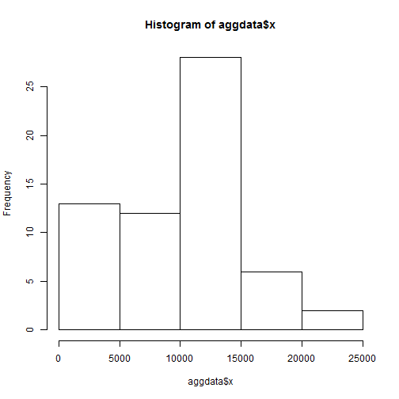
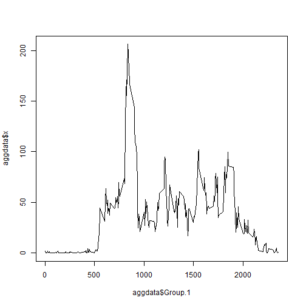
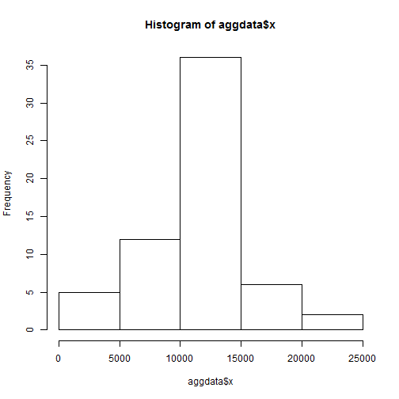
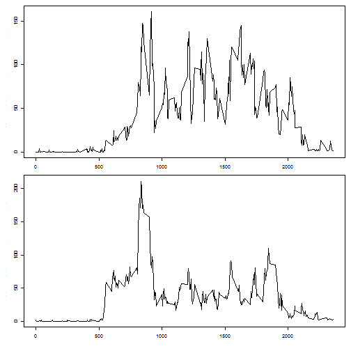

In this paper we are gonna carry out some basic statistical analysis on data retrieved from a personal activity monitoring device. To really get active and quantify results just using the device is not enough. Getting statistical insight into the data supports the goal to get active with quantifyable results.

###Loading the data###

The data is delivered as a comma separated text file. This is read into R for further processing. We do not want strings to be converted to factors and we convert the atttribute data to an actual R date.


```r
data <- read.csv("activity.csv", stringsAsFactors = FALSE)
data$date <- as.Date(data$date)
```

###Total number of steps per day###

Since the data gives the number of steps per 5 minute interval we have to aggregate the data to get the number of steps per day. Then we can simply plot a histogram to see the distribution of steps per day. Summarizing the data gives us the mean and median number of steps per day, which are 9354 respectively 10440 steps per day.


```r
aggdata <- aggregate(data$steps, by=list(data$date), FUN=sum, na.rm = TRUE)
hist(aggdata$x)
```

 

```r
sum(aggdata$x)
```

```
## [1] 570608
```

```r
summary(aggdata$x)
```

```
##    Min. 1st Qu.  Median    Mean 3rd Qu.    Max. 
##       0    6778   10400    9354   12810   21190
```

###Average daily activity pattern###

To get the average daily activity pattern we aggregate the data set again to get the average number of steps per 5 minute intervale. Plotting this gives us the distribution on average over a full day. Searching for the maximum we see that on average the most steps are taken between 8:35 and 8:40. The average number of steps during this time is 206,2 steps.


```r
aggdata <- aggregate(data$steps, by=list(data$interval), FUN=mean, na.rm = TRUE)
plot(aggdata$Group.1, aggdata$x, type="l")
```

 

```r
aggdata[aggdata$x == max(aggdata$x), ]
```

```
##     Group.1        x
## 104     835 206.1698
```

###Imputing missing values###

Until now we were ignoring missing values. To get an impression of the relevance of this we count that there are 2,304 missing elements in the data of about 52 thousand elements. 


```r
sum(is.na(data))
```

```
## [1] 2304
```

As a strategy for imputing data we decide to train a decision tree model on the data and use the predicted values for the NA values in our current data. Using the caret library this only involves a few lines of code.


```r
library(caret)
model <- train(steps ~ ., data=data, method="rpart")
```

```
## Warning in nominalTrainWorkflow(x = x, y = y, wts = weights, info =
## trainInfo, : There were missing values in resampled performance measures.
```

```r
predictedSteps <- predict(model, data)
data$steps[is.na(data$steps)] <- predictedSteps[is.na(data$steps)]
```

Looking at the mean and the media we see that they are bigger than before imputing the data. The total number of steps is also going up significantly by about 100,000 steps. THe NA value were counted as 0 values before and now they have a model calculated using our decision tree model used for imputing the data.


```r
aggdata <- aggregate(data$steps, by=list(data$date), FUN=sum, na.rm = TRUE)
hist(aggdata$x)
```

 

```r
sum(aggdata$x)
```

```
## [1] 656737.5
```

```r
summary(aggdata$x)
```

```
##    Min. 1st Qu.  Median    Mean 3rd Qu.    Max. 
##      41    9819   10770   10770   12810   21190
```

###Differences between weekdays and weekends###

Using the weekdays function we add an additional variable distinguishing between weekends and weekdays.


```r
data$weekend[weekdays(data$date) %in% c("Samstag", "Sonntag")] <- "weekend"
data$weekend[!(weekdays(data$date) %in% c("Samstag", "Sonntag"))] <- "weekday"
data$weekend <- factor(data$weekend)
```

Finally we look at the average daily activity pattern comparing weekends and weekdays. As we can easily see the patterns are significantly different.


```r
aggdata <- aggregate(data$steps, by=list(data$interval, data$weekend), FUN=mean, na.rm = TRUE)
par(mfrow = c(2, 1))
par(cex = 0.6)
par(mar = c(3, 3, 0, 0), oma = c(1, 1, 1, 1))
plot(aggdata$Group.1[aggdata$Group.2 == "weekend"], aggdata$x[aggdata$Group.2 == "weekend"], type="l")
plot(aggdata$Group.1[aggdata$Group.2 == "weekday"], aggdata$x[aggdata$Group.2 == "weekday"], type="l")
```

 
